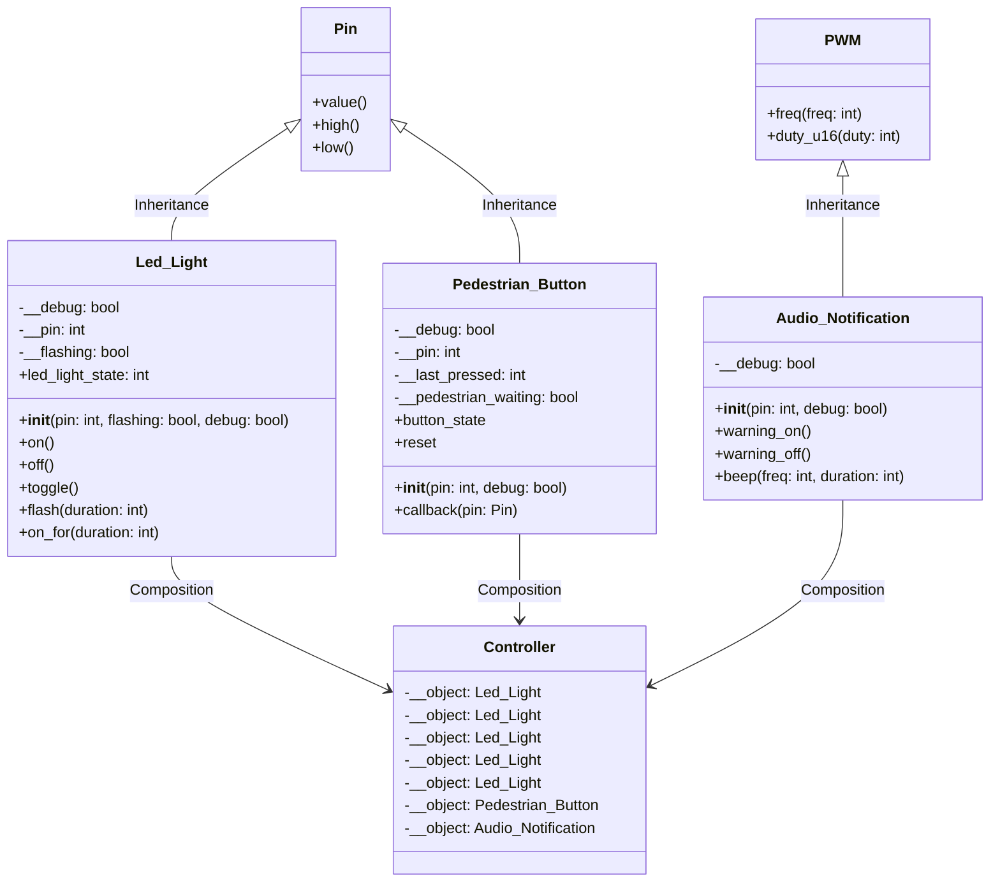

# MicroPython OOP Pi Pico Mini Project

This repository is a series of introduction tasks to teach students the basics of Pi Pico and common mechatronic components. Then students will create a mini OOP based project to explicitly teach Object Oriented Paradigm (OOP) programming concepts specifically in the microcontroller context.

Students will be recreating a model of the pedestrian crossing on Unwins Bridge Road out the front of Tempe High School.

## Introduction to Pi Pico & Common Mechatronic Commonents

### Projects

1. [Connect and control a LED](introduction_projects/1.blink_led.md)
2. [Connect a digital sensor that controls the LEDs](introduction_projects/2.digital_sensor.md)
3. [Connect a analog sensor that controls the LEDs](introduction_projects/3.analog_sensor.md)
4. [Control the brightness of the LED with Pulse Width Modulation](introduction_projects/4.pulse_width_modulation.md)
5. [Connect and control a servo motor](introduction_projects/5.servo_control.md)
6. [Connect and read a ultrasonic sensor use it to control the servo motor](introduction_projects/6.ultrasonic_sensor.md)
7. [Connect and control a I2C 16x2 LCD Display](introduction_projects/7.I2C_module.md)

### Components

- Breadboard
- Jumper leads
- Pi Pico
- 1x LED
- 1x 130Ω resistors
- 1x Potentiometer or analog sensor
- 1x Momentary switch or digital sensor
- 1x Servo motor
- 1x Ultrasonic sensor
- 1x 2IC 16x2 LCD Display

### Pin Allocation

| Pin  |                        |
| ---- | ---------------------- |
| GP0  | SDA                    |
| GP1  | SCL                    |
| GP4  | Keyboard Interrupt     |
| GP10 | Servo Motor Signal     |
| GP11 | Ultrasonic Echo Signal |
| GP12 | Ultrasonic Trig Signal |
| GP13 | Digital Sensor Signal  |
| GP15 | External LED           |
| GP25 | Inbuilt LED            |
| GP26 | Analog Sensor Signal   |
| AGND | Analog Ground          |
| GND  | Ground                 |
| 3V3  | 3V Power               |
| VBUS | 5V Power               |

## OOP Mini Project

From the above real world control system we will model:

- Overloading and overriding polymorphism
- Inheritance, multilevel inheritance and multiple class inheritance
- Abstraction
- Decomposition and composition
- Generalisation
- Encapsulation
- Object instantiation, objects as instance variables

### Wire your system

### Components

- Breadboard
- Jumper leads
- Pi Pico
- 1x Momentary switch
- 5x LED
- 1x Piezo buzzer
- 5x 130Ω resistors

### Pin allocation

| Pin  |                      |
| ---- | -------------------- |
| GP3  | Red LED              |
| GP4  | Keyboard Interrupt   |
| GP5  | Amber LED            |
| GP7  | Red LED              |
| GP17 | Flashing Green LED   |
| GP19 | Flashing Red LED     |
| GP22 | Button signal        |
| GP27 | Piezo Buzzer         |
| GND  | Circuit Ground       |
| 3V3  | Button logic voltage |

## UML Diagram

> [!Note]
> Inheritance and association labels are note required in a UML diagram but have been added for understanding.

## Versions

| Version | Notes                                                                                                                     |
| ------- | ------------------------------------------------------------------------------------------------------------------------- |
| v01.py  | Basic "Blink" Program (the Hello World of mechatronics).                                                                  |
| v02.py  | Test wiring and use basic methods from parent `Pin` class.                                                                |
| v03.py  | Implement a child class of MicroPython `Pin` class for the traffic lights, demonstrating Inheritance and Polymorphism.    |
| v04.py  | Move the `Led_Light` class to a separate file, demonstrating abstraction.                                                 |
| v05.py  | Write a `Button` class and test it by instantiating it and controlling the `red_light` instance of the `Led_Light` class. |
| v06.py  | Implement a Event Trigger for when the button has been pressed.                                                           |
| v07.py  | Demo code only of Multiple Inheritence.                                                                                   |

<a property="dct:title" rel="cc:attributionURL" href="https://github.com/TempeHS/MicroPython_OOP_Pi_Pico_Mini_Project_Source">MicroPython_OOP_Pi_Pico_Mini_Project_Source
</a> and <a property="dct:title" rel="cc:attributionURL" href="https://github.com/TempeHS/MicroPython_OOP_Pi_Pico_Mini_Project_Template">MicroPython_OOP_Pi_Pico_Mini_Project_Template
</a> by <a rel="cc:attributionURL dct:creator" property="cc:attributionName" href="https://github.com/benpaddlejones">Ben Jones</a> is licensed under <a href="https://creativecommons.org/licenses/by-nc-sa/4.0/?ref=chooser-v1" target="_blank" rel="license noopener noreferrer" style="display:inline-block;">Creative Commons Attribution-NonCommercial-ShareAlike 4.0 International</a>

