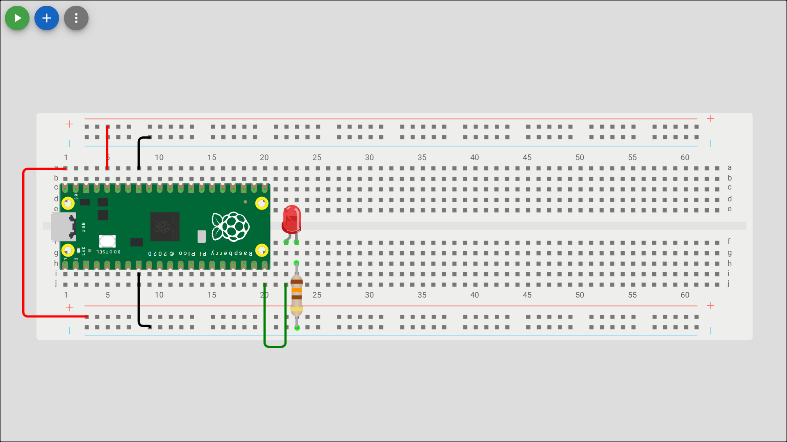

# Blink LED

Check out the [Wokwi Prototype](https://wokwi.com/projects/431255576341310465).

Don't forget to check the [Pi Pico Diagram](../Raspberry-Pi-Pico-pinout-diagram.svg) as you go:


## Blink the onboard LED

```python
from machine import Pin
from time import sleep

# Wait for USB to become ready
sleep(0.1)

#store desired output pin in a variable
led_pin = 25

#configure GPIO Pin as an output pin and create and led object for Pin class
led = Pin(led_pin, Pin.OUT)

while True:
   led.value(True)  #turn on the LED
   time.sleep(1)   #wait for one second
   led.value(False)  #turn off the LED
   time.sleep(1)   #wait for one second
```

> [!Note]
> The Onboard LED is connected to GPIO Pin 25 and useful for debugging events.

### Unit Testing

1. The onboard LED next to the USB connection should toggle on/off every second.

## Connect and blink an external LED

| LED pin         | Pi Pico pin  |
| --------------- | ------------ |
| Long (anode)    | GP15 (20)    |
| Short (cathode) | Ground (GND) |



```python
from machine import Pin
from time import sleep

# Wait for USB to become ready
sleep(0.1)

#store desired output pin in a variable
led_pin = 25
led2_pin = 15

#configure GPIO Pin as an output pin and create and led object for Pin class
led = Pin(led_pin, Pin.OUT)
led2 = Pin(led2_pin, Pin.OUT)

while True:
   led.value(True)  #turn on the LED
   led2.value(False)  #turn off the LED2
   time.sleep(1)   #wait for one second
   led.value(False)  #turn off the LED
   led2.value(True)  #turn on the LED2
   time.sleep(1)   #wait for one second
```

### Unit Testing

1. The onboard LED and external LED next to the USB connection should alternatively toggle on/off every second.

## How to calculate resistance

A resistor is required to protect the LED from over current. To calculate the resistor value for an LED connected to a 3.3V source, you need to use Ohm's Law $(V = IR)$, but first, determine the LED's forward voltage and desired forward current. The formula is R = (V_source - V_forward) / I_forward.

### Here's how to do it:

1. Find the LED's forward voltage (V_forward):
   This is the voltage drop across the LED when it's turned on. Typical values are around 2V for red/green LEDs and 3V for blue/white LEDs. If you don't know the exact forward voltage, check the LED's datasheet or consult a reference chart.
2. Determine the desired forward current (I_forward):
   This is the current you want the LED to draw. A common range is 5mA to 20mA. You can find this information in the LED's datasheet or use a typical value.
3. Calculate the resistance (R):
   Plug the values into the formula: R = (V_source - V_forward) / I_forward
   Example: Let's assume you have a 3.3V source, an LED with a forward voltage of 2V, and you want a forward current of 10mA (0.01A).

```
R = (3.3V - 2V) / 0.01A
R = 1.3V / 0.01A
R = 130 Ohms
```

You would then choose a resistor with a value close to 130 Ohms.
