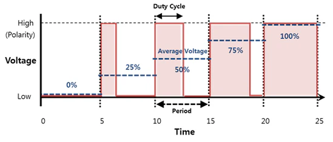

# Pulse Width Modulation

Check out the [Wokwi Prototype](https://wokwi.com/projects/431257602271002625).

Don't forget to check the [Pi Pico Diagram](../Raspberry-Pi-Pico-pinout-diagram.svg) as you go:


## Read a analogue sensor and control the LED's Brightness


> [!Note]
> There are no wiring changes required from the [analog_sensor.md](analog_sensor.md) project.

```python
from machine import Pin, ADC, PWM
from time import sleep

# Wait for USB to become ready
sleep(0.1)

#store desired output pin in a variable
led_pin = 25
led2_pin = 15
data_pin = 13
analog_data_pin = 26

#configure GPIO Pin as an output pin and create and led object for Pin class
led = PWM(Pin(led_pin))
led2 = PWM(Pin(led2_pin))

#set the PWM frequnecy for LED's
led.freq(1000)
led2.freq(1000)

#configure GPIO Pin as an input pin and create a data object for Pin class
data = Pin(data_pin, Pin.IN)

#configure GPIO Pin as an ADC pin and create a data object for ADC class that is a composition of the Pin class
analog_data = ADC(Pin(analog_data_pin))

while True:
    adc_value = analog_data.read_u16()  # 0-65535
    if data.value() == 1:
        led.duty_u16(adc_value)
        led2.duty_u16(adc_value)
    else:
        led.duty_u16(0)
        led2.duty_u16(0)
    print(f"Digital: {data.value()} , Analog: {adc_value}")
    sleep(0.1)
```

## Pulse Width Modulation (PWM)

The PWM is a technique that allows the generation of a voltage between 0 and 3.3V using only digital outputs . PWM is the acronym for Pulse With Modulation . Indeed, this trick is based on the temporal proportion of a logic signal at its high state (3.3V) and its low state (0V): the PWM consists in varying the width of an electrical pulse.



The succession of pulses with a given width is seen on average as a constant voltage between 0V and 3.3V, whose value is determined by :

$$ V*{output} = V*{input} \times \alpha $$

with $\alpha$ , the duty cycle (the pulse width in percent)

A PWM signal is configured via the duty cycle and the pulse frequency. We can modify these two parameters in MicroPython. In practice, PWM is used to :

- Controlling the speed of a motor
- Controlling the brightness of LEDs
- Generate square signals (with α=0.5)
- Generate music notes (sound similar to retro consoles)
