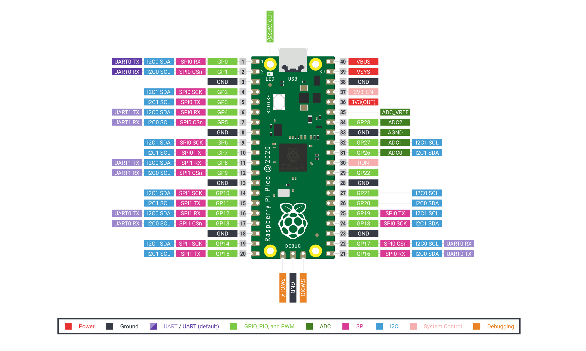
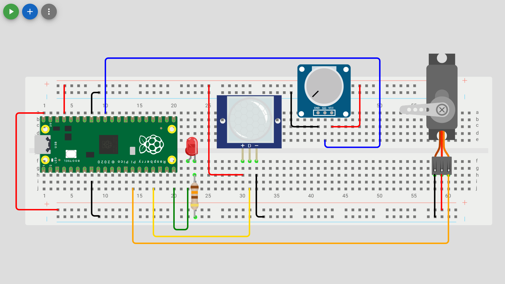

# Servo Control

Check out the [Wokwi Prototype](https://wokwi.com/projects/431257715567549441).

Don't forget to check the [Pi Pico Diagram](../Raspberry-Pi-Pico-pinout-diagram.svg) as you go:


## Read a analogue sensor and control a servo motor

| Servo Motor Pin | Pico pin            |
| --------------- | ------------------- |
| Ground (brown)  | Ground (GND)        |
| Data (orange)   | GP10                |
| Power (red)     | 5V (VBUS)           |



> [!Important]
> There are two types of servo motors, positional and continuous. A postional servo motor (usually 180° or 270°) will position its self based on the PWM signal. So a 500µs signal is position 0 and 2500µs signal is the nth-last position (180 or 270). A continuous servo is a DC motor with a controler with the speed and directing being set by the signal. So a 500µs signal is fastest speed in reverse, 1500µs signal is stop and a 2500µs signal is fastest speed forward.

```python
from machine import Pin, ADC, PWM
from time import sleep

# Wait for USB to become ready
sleep(0.1)

#store desired output pin in a variable
led_pin = 25
led2_pin = 15
data_pin = 13
analog_data_pin = 26
servo_pin = 10

#configure GPIO Pin as an output pin and create and led object for Pin class
led = PWM(Pin(led_pin))
led2 = PWM(Pin(led2_pin))

#set the PWM frequnecy for LED's
led.freq(1000)
led2.freq(1000)

#configure GPIO Pin as an output pin and create and servo object for Pin class
servo = PWM(Pin(servo_pin))

#set the PWM frequnecy for a Servo
servo.freq(50) #pulse every 20ms

#configure GPIO Pin as an input pin and create a data object for Pin class
data = Pin(data_pin, Pin.IN)

#configure GPIO Pin as an ADC pin and create a data object for ADC class that is a composition of the Pin class
analog_data = ADC(Pin(analog_data_pin))

#function to calculate pulse width in microseconds
def set_angle(angle):
    #clamps the input angle to the range 0–180
    angle = min(max(angle, 0), 180)
    #return PWM mapping 0° to 500 µs and 180° to 2500 µs (standard for many servos).
    return int(500 + (angle / 180) * 2000)

#function to linearly map values
def map_range(value, in_min, in_max, out_min, out_max):
    return int((value - in_min) * (out_max - out_min) / (in_max - in_min) + out_min)

while True:
    adc_value = analog_data.read_u16()  # 0-65535
    if data.value() == 1:
        led.duty_u16(adc_value)
        led2.duty_u16(adc_value)
    else:
        led.duty_u16(0)
        led2.duty_u16(0)
    mapped_value = map_range(adc_value, 0, 65535, 0, 180)
    servo.duty_ns(set_angle(mapped_value)*1000)
    print(f"Digital: {data.value()} , Analog: {adc_value} , Servo: {servo.duty_ns()}")
    sleep(0.1)
```

> [!Note]
> For Servos the `.duty_ns()` method is more accurate than the `.duty_u16()` method but we need to convert µs to ns with `* 1000`.

### Unit Testing

1. The onboard LED and external LED next to the USB connection should alternatively toggle on/off in response to the digital sensor.
2. The brightness of both the onboard LED and external LED should be responsive the analog sensor.
3. The servo should sweep 180° in response to the analog sensor.
