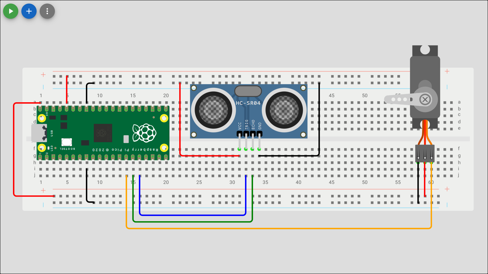

# Ultrasonic Sensor

Check out the [Wokwi Prototype](https://wokwi.com/projects/431264773537206273).

Don't forget to check the [Pi Pico Diagram](../Raspberry-Pi-Pico-pinout-diagram.svg) as you go:


## Read a analogue sensor and control the LED's

| Ultrasonic Sensor Pin | Pico pin        |
| --------------------- | --------------- |
| Ground (-, GND, G)    | Ground (GND)    |
| Trig                  | GP12            |
| Echo                  | GP11            |
| Power (+, VCC, PWR)   | 3.3V (3V3(OUT)) |



> [!Note]
> An ultrasonic sensors sends out a ultrasonic wave from the `trig` pin then listens for the wave to bounce back on the `echo` pin. It uses time and teh speed of travel of a ultrasonic wave divided in half to calculate the approximate distance an object is away. They are are a cheap solution but they are affected by complex surfaces, environmental changes (temerpature and humidity), and their own noise.

```python
from machine import Pin, PWM, time_pulse_us
from time import sleep, sleep_us

# Wait for USB to become ready
sleep(0.1)

#store desired output pins in a variable
TRIG_PIN = 12
ECHO_PIN = 11
servo_pin = 10

#configure GPIO Pin as an output pin and create and servo object for Pin class
servo = PWM(Pin(servo_pin))

#set the PWM frequnecy for a Servo
servo.freq(50) #pulse every 20ms

#configure Echo & Trig GPIO Pins as objects for Pin class
trig = Pin(TRIG_PIN, Pin.OUT)
echo = Pin(ECHO_PIN, Pin.IN)

#function to calculate pulse width in microseconds
def set_angle(angle):
    #clamps the input angle to the range 0–180
    angle = min(max(angle, 0), 180)
    #return PWM mapping 0° to 500 µs and 180° to 2500 µs (standard for many servos).
    return int(500 + (angle / 180) * 2000)

#function to linearly map values
def map_range(value, in_min, in_max, out_min, out_max):
    return int((value - in_min) * (out_max - out_min) / (in_max - in_min) + out_min)

def get_distance():
    # Send a 10us pulse to trigger
    trig.value(0)
    sleep_us(2)
    trig.value(1)
    sleep_us(10)
    trig.value(0)

    # Wait for echo, measure the duration
    try:
        pulse_time = time_pulse_us(echo, 1, 30000)  # Wait for HIGH
    except OSError as ex:
        if ex.args[0] == 110:  # Timeout
            return None
        raise ex

    # Calculate distance (speed of sound = 340 m/s)
    distance_cm = (pulse_time / 2) / 29.1
    return distance_cm

while True:
    dist = get_distance()
    if dist is not None:
        mapped_value = map_range(dist, 0, 410, 0, 180) #adjust range as needed
        servo.duty_ns(set_angle(mapped_value)*1000)
    else:
        print('Out of range')
    print(f"Distance: {dist} , Servo: {servo.duty_ns()}")
    sleep(0.1)
```

### Unit Testing

1. The servo should sweep 180° in response to the distance measured by the ultrasonic sensor.
