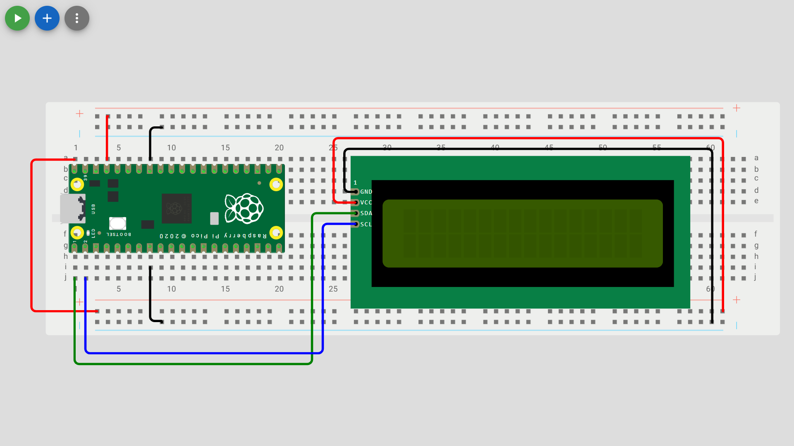

# I2C Module

Check out the [Wokwi Prototype](https://wokwi.com/projects/431267438404154369).

Don't forget to check the [Pi Pico Diagram](../Raspberry-Pi-Pico-pinout-diagram.svg) as you go:


## Display text on a I2C 16x2 LCD display

| LCD Display         | Pico pin        |
| ------------------- | --------------- |
| Ground (-, GND, G)  | Ground (GND)    |
| SDA                 | GP0 (I2C1 SDA)  |
| SCL                 | GP1 (I2C1 SCL)  |
| Power (+, VCC, PWR) | 3.3V (3V3(OUT)) |



> [!Note]
> Multiple I2C Modules can be connected to the same SDA/SCL pins but there will be conflicts if multiple modules have the same address.

```python
# modules
from machine import I2C, Pin    # since I2C communication would be used, I2C class is imported
from time import sleep

# very important
# this module needs to be saved in the Raspberry Pi Pico in order for the LCD I2C to be used
from pico_i2c_lcd import I2cLcd

# creating an I2C object, specifying the data (SDA) and clock (SCL) pins used in the Raspberry Pi Pico
# any SDA and SCL pins in the Raspberry Pi Pico can be used (check documentation for SDA and SCL pins)
i2c = I2C(0, sda=Pin(0), scl=Pin(1), freq=400000)

# getting I2C address
I2C_ADDR = i2c.scan()[0]

# creating an LCD object using the I2C address and specifying number of rows and columns in the LCD
# LCD number of rows = 2, number of columns = 16
lcd = I2cLcd(i2c, I2C_ADDR, 2, 16)

# continuously print and clear "Hello world!" text in the LCD screen while the board has power
while True:
    # putstr method allows printing of the text in the LCD screen
    # for other methods that can be used, check lcd_api module
    lcd.putstr("Hello world!")
    sleep(5)        # "Hello world!" text would be displayed for 5 secs
    lcd.clear()
    sleep(1)        # clear the text for 1 sec then print the text again
```

### Unit Testing

1. The top line of the LCD display should read "Hello world!"
